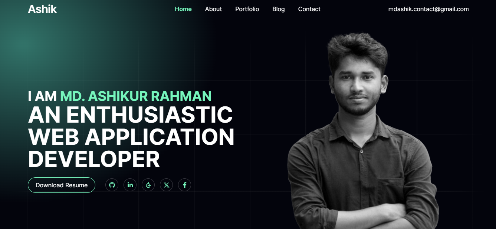
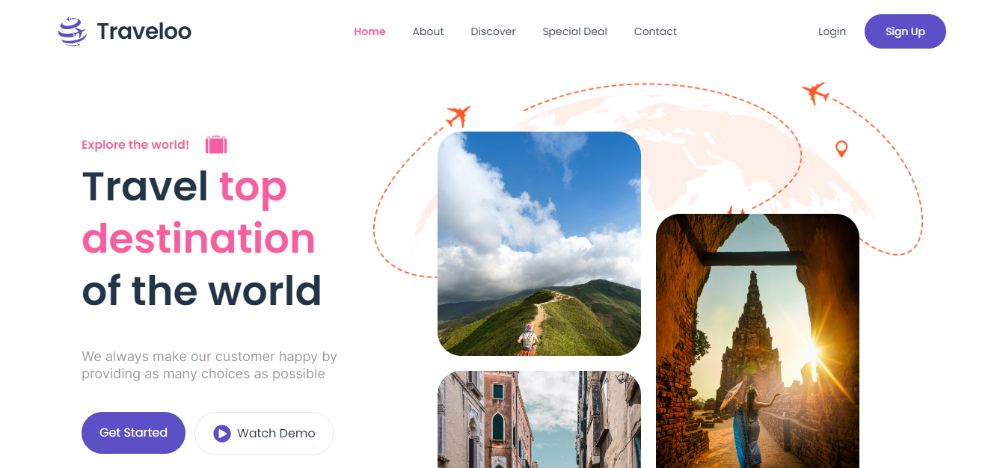
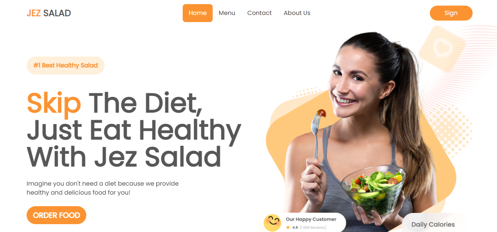
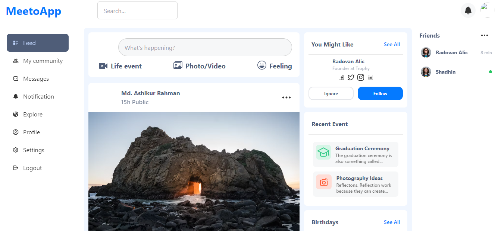

# <h1 align="center" > MD. ASHIKUR RAHMAN </h1>
<h3 align="center" >React Developer | Frontend Developer | MERN Stack Developer | Competitive Programmer</h3>
 

    
    
    
  

  
###
<h3 align="left">🧑‍💻  About Me</h3>

###

- 🔭 I’m working as React Developer - 🎯 I'm currently learning Python - ♟️ In my free time I play cricket

## :hammer_and_wrench: Skills

  
   
   

   
   
   
   
   
   
   
   
   
    
     

###

## My Portfolio

## Latest Projects

<table style="width:100%">
  <tr>
    <td style="width:33%; padding: 5px;">
      

         
        <h3>Traveloo</h3>
        
A travel website enabling global travel searches, hotel bookings.

      

    </td>
    <td style="width:33%; padding: 5px;">
      

         
        <h3>Jez Salad</h3>
        
A responsive ReactJS based Restaurant website.

      

    </td>
     <td style="width:33%; padding: 5px;">
      

         
     <h3>Meeto app</h3>
       
A responsive ReactJS based Social media website.

      

    </td>
  </tr>
</table>

## 📊 GitHub Stats:

  
   

## 🏆 GitHub Trophies

---

