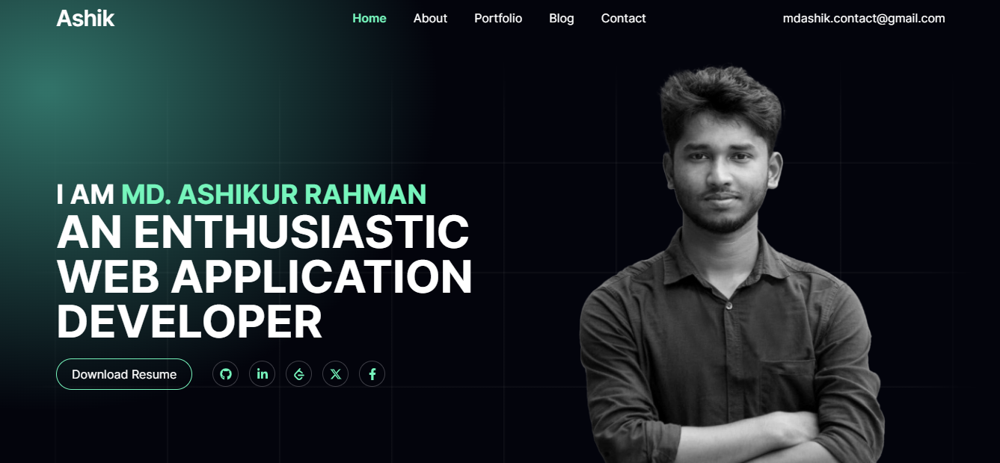

# <h1 align="center" > MD. ASHIKUR RAHMAN </h1>
<h3 align="center" >React Developer | Frontend Developer | MERN Stack Developer | Competitive Programmer</h3>
 

    
    
    
  

I have specialized in creating user-friendly, responsive designs. I am confident that my skills and experience would be a valuable asset to you. I have a strong understanding of front-end development and am proficient in using HTML, CSS, Bootstrap, Tailwind CSS, JavaScript and React. I am passionate about web development and enjoy working on projects that challenge me to think outside the box.

 
## My Webpage

Check out my [website](https://mdashik.vercel.app) for more details.

#### :hammer_and_wrench: Languages and Tools :

  &nbsp;
  &nbsp;
  &nbsp;
  &nbsp;
  &nbsp;
  &nbsp;
  &nbsp;
  &nbsp;
  &nbsp;
  &nbsp;
  &nbsp;
  &nbsp;
  &nbsp;
  &nbsp;
  

# 📊 GitHub Stats:
 
 

## 🏆 GitHub Trophies

---

